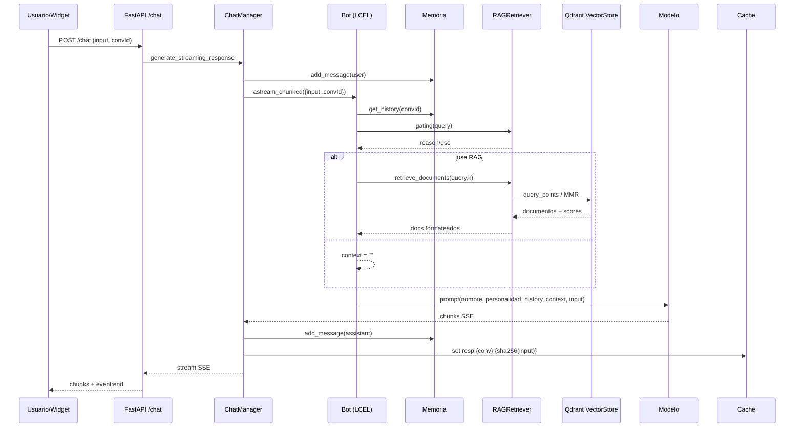

# 🧩 Backend Técnico — Chatbot RAG

Este documento describe en detalle la arquitectura interna, flujo de datos, lógica de negocio y orquestación de servicios del backend. Está orientado a uso interno y profundiza en cómo el sistema opera por dentro: FastAPI, autenticación, memoria conversacional, RAG (Qdrant + OpenAI Embeddings), caché (Redis/InMemory), rutas de administración y webhook de WhatsApp.

---

## 🏛️ Arquitectura General

- Stack principal
  - `FastAPI` para API HTTP y SSE streaming
  - `MongoDB (Motor)` para usuarios y sesiones de WhatsApp
  - `Qdrant` como Vector DB para RAG
  - `LangChain Core (LCEL)` para componer `prompt → modelo`
  - `OpenAI Embeddings` para generación de vectores
  - `Redis` opcional; fallback a `InMemoryCache` con TTL
  - `Twilio WhatsApp` para recepción/envío de mensajes

- Seguridad y acceso
  - Middleware de autenticación con separación estricta de rutas públicas y admin
  - Rutas públicas exactas: `/api/v1/health`, `/api/v1/auth/*` (login/refresh/etc.), `/api/v1/chat`, `/api/v1/whatsapp/webhook`
  - Rutas protegidas por admin: prefijos `/api/v1/pdfs`, `/api/v1/rag`, `/api/v1/bot`, `/api/v1/users`

- Orquestación del bot
  - `Bot` construye el pipeline LCEL completo: `input → memory → history → context (RAG) → prompt → model`
  - `ChainManager` gestiona `prompt → model` con variables de personalidad y parámetros del modelo
  - `RAGRetriever` decide cuándo inyectar contexto y cómo recuperar documentos
  - `ChatManager` coordina streaming, persistencia y caché de respuestas

### Diagrama de Flujo (Petición → Respuesta)

```mermaid
flowchart TD
    A[Cliente/Widget/WhatsApp] -->|HTTP POST /chat (SSE)| B(FastAPI Router)
    A2[Twilio Webhook] -->|POST /whatsapp/webhook| B
    B --> C{Auth Middleware}
    C -->|Public exact| D[ChatManager]
    C -->|Admin prefix| E[Validación JWT + Roles]
    E --> F[Rutas Admin]
    D --> G[Bot Pipeline]
    G --> H{LCEL}
    H -->|history| I[Memoria]
    H -->|context| J[RAGRetriever]
    J --> K[VectorStore/Qdrant]
    H -->|prompt→model| L[ChainManager]
    L --> M[LLM]
    M --> N[Streaming SSE]
    N --> O[Persistencia (Mongo messages)]
    O --> P[Cache resp: conv+sha256]
    P --> Q[Cliente]
```

---

## 🧠 Deep Dive: Pipeline RAG

### 1) Ingesta
- Componente: `rag.ingestion.ingestor.RAGIngestor`
- Proceso
  - Recepción de PDF via `pdf_routes.upload_pdf`
  - Detección de duplicados antes de indexar
    - `content_hash_global`: MD5 del contenido normalizado de todo el PDF (concat de páginas, min-normalización). Si existe, se omite.
    - `pdf_hash`: MD5 del binario del archivo. Compatibilidad para evitar reindexados duplicados.
  - Chunking
    - `PDFContentLoader` con `chunk_size`, `chunk_overlap`, `min_chunk_length` desde `settings`
    - Cada chunk hereda metadatos: `source` (filename), `pdf_hash`, `content_hash_global`, `page_number` opcional
  - Inserción
    - Embeddings en batch vía `EmbeddingManager.embed_documents`
    - `VectorStore.add_documents` upsert a Qdrant con payload `text` + metadatos
    - Invalidación de caché relacionada (`vs:`) después de ingesta

### 2) Embeddings
- Componente: `rag.embeddings.embedding_manager.EmbeddingManager`
- Modelo: `OpenAIEmbeddings` (p. ej. `text-embedding-3-small`)
- Estrategias
  - Cache de embeddings por clave: `emb:doc:{model}:{sha256(text_norm)}` y `emb:query:{model}:{sha256(query_norm)}`
  - Validación estricta de dimensión `default_embedding_dimension` (ej. 1536) y fallback a vector nulo si hay inconsistencia
  - Batch interno configurable (`embedding_batch_size`)

### 3) Vector Database
- Componente: `rag.vector_store.vector_store.VectorStore`
- Inicialización
  - Crea/asegura colección `rag_collection` con `VectorParams(size=dim, distance=cosine)`
  - Asegura índices de payload críticos: `source`, `pdf_hash`, `content_hash_global`
- Payload por punto
  - `text`: contenido del chunk
  - Metadatos: `source`, `pdf_hash`, `content_hash_global`, `page_number`, `id`, `score` (en retrieval), y opcionalmente `vector` cuando se pide `with_vectors`
- Operaciones
  - `add_documents` con validación de dimensión y tipos
  - `delete_documents` por filtro; `delete_by_pdf_hash` y `delete_by_content_hash_global`
  - `delete_collection` reinicia la colección e invalida caché `vs:`

### 4) Retrieval
- Componente: `rag.retrieval.retriever.RAGRetriever`
- Gating (decide si usar RAG)
  - Heurísticas: longitud mínima, small-talk, interrogativos
  - Centroide del corpus: cálculo y uso con threshold dinámico `rag_gating_similarity_threshold`
  - Cache de tamaño de corpus con invalidación automática del centroide si cambia el conteo
  - Activación con corpus pequeño (< 20) bajo condiciones de intención
- Búsqueda
  - Similaridad: `NearestQuery` en Qdrant con `distance=cosine`
  - `MMR` (Maximal Marginal Relevance): mezcla relevancia/diversidad con `lambda_mult` y `fetch_k = k * retrieval_k_multiplier`
  - Filtrado: `Filter(must=[FieldCondition(key=..., match=...)])`
  - `score_threshold` configurable para descartar resultados débiles
- Formateo de contexto
  - `format_context_from_documents(docs)` concatena `page_content` con delimitadores y metadatos
  - El `Bot` almacena `self._last_retrieved_docs` y `self._last_context` para debugging

### 5) Generación
- Orquestación: `core.bot.Bot`
  - LCEL: `RunnableMap({input, history, context}) | ChainManager.runnable_chain`
  - `history` desde `memory.get_history(conversation_id)`, formateado para prompt
  - `context` desde `RAGRetriever.retrieve_documents` si gating permite
  - Métricas de tiempo: `self._last_rag_time` y estimación de tokens para debug
- Cadena Prompt → Modelo: `core.chain.ChainManager`
  - Prompt base desde `core.prompt`, con variables parciales: `nombre` y `bot_personality`
  - `ui_prompt_extra` de `settings` se concatena a la personalidad
  - Modelo según `settings.model_type`, con kwargs: `temperature`, `max_tokens`, `model_name`
- Streaming y Persistencia: `chat.manager.ChatManager`
  - SSE: `bot.astream_chunked` produce chunks; el primer chunk se espera con timeout `settings.llm_timeout`
  - Persistencia en Mongo `messages`: roles `user`/`assistant`, `timestamp`, `source`
  - Cache de respuesta final por conversación y input normalizado

---

## ⚡ Sistema de Caché y Optimización

- Manager unificado: `cache.manager.CacheManager`
  - Selección automática de backend: `RedisCache` si `REDIS_URL` presente, si no `InMemoryCache`
  - TTL global: `settings.cache_ttl`
  - Tamaño máximo para memoria: `settings.max_cache_size` con FIFO y limpieza de expirados
  - Métodos: `get`, `set`, `delete`, `invalidate_prefix`

- Backends
  - `RedisCache`
    - Serialización: `JSON:` para tipos JSON, `PKL:` para `pickle` como fallback
    - `unlink` preferido para borrado asíncrono; invalidación por `scan_iter(prefix)`
  - `InMemoryCache`
    - Dict con `expires_at`; limpieza periódica al `get`/`set`; FIFO si excede `max_size`

- Claves principales
  - Respuestas chat: `resp:{conversation_id}:{sha256(input_norm)}`
  - RAG retrieval: `rag:{query}:{k}:{filter_key}`
  - Embeddings documento: `emb:doc:{model}:{sha256(text_norm)}`
  - Embedding consulta: `emb:query:{model}:{sha256(query_norm)}`
  - VectorStore: invalidaciones por prefijo `vs:` tras ingesta/eliminación

- Estrategias de invalidación
  - Por prefijo: `invalidate_prefix("rag:")`, `invalidate_prefix("vs:")`, `invalidate_prefix("resp:")`
  - Eventos disparadores
    - Upload/Delete PDF: invalida `resp:`, `vs:` y `rag:` y resetea centroide en `RAGRetriever`
    - `clear-rag`: borra colección, limpia PDFs y reinicia cachés/centroide

---

## 🔌 Catálogo de Endpoints y Flujos

### Chat (público)
- `POST /api/v1/chat/` — streaming SSE
  - Trigger: mensaje del cliente
  - Lógica
    - Valida JSON → `ChatRequest` (input, conversation_id opcional, source, flags)
    - Chequea `bot.is_active`
    - Inicia generador SSE: `ChatManager.generate_streaming_response`
      - Guarda mensaje `user` (si no `debug_mode`)
      - Busca respuesta en caché `resp:`; si existe, retorna y persiste
      - Ejecuta `bot.astream_chunked` y emite chunks
      - Persiste respuesta final y guarda en memoria conversacional
      - Cachea respuesta final
    - Emite `event:end`; si `debug_mode`, adjunta `event:debug` con documentos, prompt, tiempos, estimación de tokens y verificación opcional
  - Dependencias: `ChatManager`, `Bot`, `MongoDB messages`, `CacheManager`

- `GET /api/v1/chat/history/{conversation_id}` — historial
  - Trigger: cliente pide historial
  - Lógica: lee colección `messages`, ordena por `timestamp`, normaliza ISO, retorna `role/content/timestamp/source`
  - Dependencias: `MongoDB messages`

### PDFs (admin)
- `POST /api/v1/pdfs/upload`
  - Trigger: subida de archivo
  - Lógica: valida tamaño, guarda físico, ingesta `RAGIngestor`, dedup por `content_hash_global` y `pdf_hash`; si duplicado, 409 y borra el nuevo
  - Dependencias: `PDFManager`, `RAGIngestor`, `EmbeddingManager`, `VectorStore`, `CacheManager`

- `GET /api/v1/pdfs/list`
  - Trigger: listar archivos
  - Lógica: lectura de directorio, metadatos (size, mtime) → DTO

- `DELETE /api/v1/pdfs/{filename}`
  - Trigger: borrar un PDF
  - Lógica: borra físico, elimina vectores por `source`, invalida `rag:`/`vs:`/`resp:`, resetea centroide
  - Dependencias: `PDFManager`, `VectorStore`, `RAGRetriever`, `CacheManager`

- `GET /api/v1/pdfs/download/{filename}` / `GET /api/v1/pdfs/view/{filename}`
  - Trigger: descarga/visualización
  - Lógica: FileResponse desde directorio gestionado

### RAG (admin)
- `GET /api/v1/rag/rag-status`
  - Trigger: diagnóstico de PDFs y vector store
  - Lógica: compone listado de PDFs y datos de Qdrant (URL, colección, conteo)

- `POST /api/v1/rag/clear-rag`
  - Trigger: limpieza completa
  - Lógica: borra PDFs; borra colección Qdrant; invalida `rag:`/`vs:`/`resp:`; resetea centroide; verifica conteos finales

- `POST /api/v1/rag/retrieve-debug`
  - Trigger: auditoría de recuperación
  - Lógica: ejecuta `retrieve_with_trace` con `k` seguro; retorna items con `text`, `score`, metadatos y contexto formateado

- `POST /api/v1/rag/reindex-pdf`
  - Trigger: reindexación forzada
  - Lógica: ingesta síncrona con `force_update`; elimina vectores previos por `content_hash_global` y `pdf_hash`; resetea centroide e invalida caché

### Bot (admin)
- `GET /api/v1/bot/state` / `POST /api/v1/bot/toggle`
  - Trigger: consulta y cambio de estado operativo del bot
  - Lógica: lectura/flip de `bot.is_active`

- `GET /api/v1/bot/runtime`
  - Trigger: inspección runtime
  - Lógica: expone `model_name/temperature/max_tokens`, nombre efectivo y longitudes de personalidad y extras UI

### Configuración de Bot (admin)
- `GET /api/v1/bot/config` / `PUT /api/v1/bot/config`
  - Trigger: lectura/actualización de configuración
  - Lógica: `ConfigRepository` en Mongo; al actualizar, propaga a `settings` y llama `bot.reload_chain(settings)` para reconstruir LCEL
  - Campos gestionados: `system_prompt`, `temperature`, `bot_name`, `ui_prompt_extra`, credenciales Twilio

- `POST /api/v1/bot/config/reset`
  - Trigger: reseteo de UI extras
  - Lógica: limpia `bot_name/ui_prompt_extra` y recarga chain

### Usuarios (admin)
- `GET /api/v1/users/users`
  - Lógica: filtros por `search/role/is_active`, paginación; valida documentos uno a uno contra `models.user.User`
- `POST /api/v1/users/users`
  - Lógica: crea usuario, asegura unicidad de email y username; hash de password; opcional `is_admin`
- `PATCH /api/v1/users/users/{user_id}`
  - Lógica: actualiza campos validados; si `password` presente, re-hash
- `DELETE /api/v1/users/users/{user_id}`
  - Lógica: elimina por `_id`; requiere admin

### WhatsApp
- `POST /api/v1/whatsapp/webhook` (público)
  - Trigger: webhook Twilio entrante
  - Lógica: valida firma (corrige esquema HTTPS detrás de proxy), extrae `wa_id` y `text`, gestiona sesión con `WhatsAppSessionRepository`, encola `process_message_background` que usa `ChatManager.generate_response` y `WhatsAppClient.send_text`

- Diagnóstico (admin)
  - `GET /api/v1/whatsapp/test` — verifica conexión con Twilio REST
  - `GET /api/v1/whatsapp/diag` — expone estado de credenciales (enmascaradas)
  - `GET /api/v1/whatsapp/send-test?to=whatsapp:+NNN&text=...` — envío de prueba

### Health
- `GET /api/v1/health` — ok/version/entorno

---

## 🛠️ Modelos y Estructuras de Datos

- Pydantic DTOs (centralizado en `api/schemas`)
  - `ChatRequest`: `input`, `conversation_id?`, `source?`, `debug_mode?`, `enable_verification?`
  - `HealthResponse`: `status`, `version`, `environment`
  - `BotConfigDTO` y `UpdateBotConfigRequest`: campos de configuración del bot y Twilio
  - `RAGStatusResponse`, `RAGStatusPDFDetail`, `RAGStatusVectorStoreDetail`: diagnóstico de RAG
  - `RetrieveDebugRequest/Response/Item`: auditoría de recuperación
  - `PDFUploadResponse/PDFListResponse/PDFDeleteResponse/PDFListItem`

- Modelos de dominio
  - `models.user.User`: representación del usuario con flags `is_admin/is_active`, timestamps, y last_login
  - `common.objects.Message`: estructura base para historial y memoria

- Vector Store Payload (Qdrant)
  - `text`: contenido chunk
  - Metadatos: `source`, `pdf_hash`, `content_hash_global`, `page_number`, `id`, `score`, opcional `vector`

---

## 🔒 Middleware de Autenticación

- Componente: `auth.middleware.AuthenticationMiddleware`
  - `PUBLIC_EXACT`: rutas públicas exactas; se evita fuga de rutas internas
  - `ADMIN` por prefijo: requiere token Bearer válido, usuario activo y rol admin
  - Errores consistentes: 401 sin token, 403 en autorización

---

## 🔧 Configuración (Settings relevantes)

- Seguridad: JWT `jwt_*`, CORS `cors_*`, `client_origin_url`
- Modelos: `model_type`, `base_model_name`, `temperature`, `max_tokens`, `main_prompt_name`, `ui_prompt_extra`
- RAG (chunking): `chunk_size`, `chunk_overlap`, `min_chunk_length`, `max_file_size_mb`
- RAG (retrieval): `retrieval_k`, `retrieval_k_multiplier`, `mmr_lambda_mult`, `similarity_threshold`, `rag_gating_similarity_threshold`
- Vector Store: `qdrant_url`, `qdrant_api_key`, `default_embedding_dimension`, `distance_strategy`
- Embeddings: `embedding_model`, `embedding_batch_size`
- Cache: `enable_cache`, `cache_ttl`, `max_cache_size`, `cache_store_embeddings`
- Twilio: `twilio_account_sid`, `twilio_auth_token`, `twilio_whatsapp_from`

---

## 🗺️ Flujo RAG (Mermaid)



---

## 📌 Notas Operativas

- El sistema prioriza consistencia en caché y evita resultados obsoletos tras operaciones de ingesta/eliminación.
- El `reload_chain` se ejecuta al actualizar config del bot, reconstruyendo el pipeline LCEL sin reiniciar la app.
- El webhook de WhatsApp valida firmas de Twilio y corrige URL bajo proxies (`X-Forwarded-Proto`), evitando falsos negativos.

---

## 🧪 Observabilidad y Debug

- Logs detallados de gating y tiempos RAG/LLM en `Bot`
- `ChatManager` puede devolver `event:debug` con:
  - Documentos recuperados (`text`, `source`, `score`, `page_number`)
  - Prompt hidratado final y parámetros de modelo
  - Tiempos (`rag_time`, `llm_time`) y estimación de tokens
  - Verificación de grounding opcional (`enable_verification`)

---

## 🧯 Manejo de Errores

- Validaciones de entrada con Pydantic (`422` en cuerpos inválidos)
- Timeouts configurables en primer chunk SSE
- Errores de caché no rompen flujo; operaciones cache son best-effort
- Endpoints admin devuelven 401 sin token y 403 en authorization failures

---

## 📎 Directorios Clave

- `api/app.py`: bootstrap de aplicación, CORS, routers, lifespan, inicialización de RAG
- `core/bot.py`: pipeline LCEL end-to-end
- `core/chain.py`: `prompt → model`
- `rag/ingestion/ingestor.py`: ingesta PDF y deduplicación
- `rag/vector_store/vector_store.py`: gestión Qdrant y retrieval (MMR/similarity)
- `rag/retrieval/retriever.py`: gating, cache RAG, formateo contexto
- `rag/embeddings/embedding_manager.py`: generación y cache de embeddings
- `chat/manager.py`: streaming, persistencia y cache de respuestas
- `auth/middleware.py`: protección de rutas públicas/admin
- `database/*`: repositorios Mongo (usuarios, config, sesiones WhatsApp)

---

Fin del documento técnico.