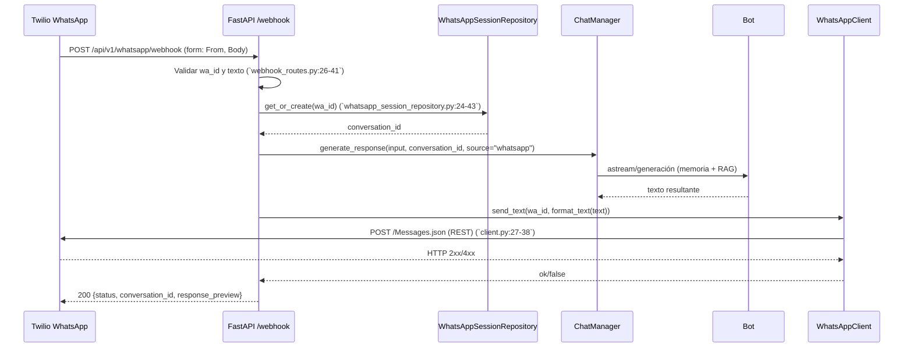

# Backend Chatbot RAG

Backend en FastAPI para un chatbot con RAG (Retrieval-Augmented Generation), autenticación JWT, streaming SSE y persistencia en MongoDB. Este README refleja el estado actual del proyecto y proporciona guía de instalación, configuración y operación.

## Descripción del Proyecto

- API HTTP que expone endpoints para autenticación, chat en streaming, gestión de PDFs, administración de RAG y usuarios.
- Recuperación de contexto con Qdrant como vector store y embeddings de OpenAI.
- Persistencia de mensajes y usuarios en MongoDB; caché opcional en memoria o Redis.
- Arquitectura modular con inicialización controlada vía `lifespan` y middleware de autenticación para rutas administrativas.

## Requisitos del Sistema

- Python `3.11` (recomendado; ver `Dockerfile` base)
- Pip `>=23`
- MongoDB `>=4.4` accesible (por defecto `chatbot_rag_db`)
- Qdrant `>=1.7` accesible en `QDRANT_URL` (por defecto `http://localhost:6333`)
- Redis opcional para caché (`REDIS_URL`)
- Clave de OpenAI válida (`OPENAI_API_KEY`)

Nota: No se requiere Node.js para el backend. El frontend (si existe) puede requerir Node, pero no forma parte de este documento.

## Configuración Inicial

1. Clonar el repositorio
   - `git clone <URL_DEL_REPO>`
   - `cd Chatbot_Rag_final/backend`
2. Crear y activar entorno virtual
   - Linux/macOS: `python3 -m venv .venv && source .venv/bin/activate`
   - Windows: `python -m venv .venv && .\.venv\Scripts\activate`
3. Instalar dependencias
   - `pip install --upgrade pip`
   - `pip install -r requirements.txt`
   - Para exportar a Excel: `pip install xlsxwriter` (usado por `export-conversations`)
4. Configurar variables de entorno
   - Crear `backend/.env` con los campos de la sección Variables de Entorno
5. Arrancar servicios externos
   - MongoDB accesible según `MONGO_URI`
   - Qdrant accesible según `QDRANT_URL` (puede ser contenedor local)

## Variables de Entorno

Ejemplo de `backend/.env` mínimo funcional:

```env
# Servidor
HOST=0.0.0.0
PORT=8000
ENVIRONMENT=development
LOG_LEVEL=INFO
DEBUG=false

# Seguridad (JWT)
JWT_SECRET=super-secret-jwt-key
JWT_ALGORITHM=HS256
JWT_ACCESS_TOKEN_EXPIRE_MINUTES=30
JWT_REFRESH_TOKEN_EXPIRE_DAYS=7

# CORS
CORS_ORIGINS=http://localhost:3000
CORS_ORIGINS_WIDGET=
CORS_ORIGINS_ADMIN=
CLIENT_ORIGIN_URL=
CORS_MAX_AGE=3600

# Modelo y OpenAI
MODEL_TYPE=OPENAI
OPENAI_API_KEY=<tu-api-key>
BASE_MODEL_NAME=gpt-3.5-turbo
MAX_TOKENS=2000
TEMPERATURE=0.7

# MongoDB
MONGO_URI=mongodb://localhost:27017
MONGO_DATABASE_NAME=chatbot_rag_db
# MONGO_COLLECTION_NAME actualmente no usado por el cliente Mongo
MONGO_MAX_POOL_SIZE=100
MONGO_TIMEOUT_MS=5000

# Redis (opcional)
REDIS_URL=

# RAG - PDFs
RAG_CHUNK_SIZE=1000
RAG_CHUNK_OVERLAP=150
MIN_CHUNK_LENGTH=100
MAX_FILE_SIZE_MB=10

# RAG - Recuperación
RETRIEVAL_K=4
RETRIEVAL_K_MULTIPLIER=3
MMR_LAMBDA_MULT=0.5
SIMILARITY_THRESHOLD=0.3

# RAG - Ingesta
BATCH_SIZE=100
DEDUP_THRESHOLD=0.95

# RAG - Vector Store
VECTOR_STORE_PATH=./backend/storage/vector_store/chroma_db
DISTANCE_STRATEGY=cosine
QDRANT_URL=http://localhost:6333
QDRANT_API_KEY=

# RAG - Embeddings
EMBEDDING_MODEL=openai:text-embedding-3-small
EMBEDDING_BATCH_SIZE=32
DEFAULT_EMBEDDING_DIMENSION=1536

# Caché local
MAX_CACHE_SIZE=1024
CACHE_STORE_EMBEDDINGS=true
ENABLE_CACHE=true
CACHE_TTL=3600

# Directorios
STORAGE_DIR=./backend/storage
DOCUMENTS_DIR=./backend/storage/documents
PDFS_DIR=./backend/storage/documents/pdfs
CACHE_DIR=./backend/storage/cache
TEMP_DIR=./backend/storage/temp
BACKUP_DIR=./backend/storage/backups

# UI dinámica (opcional)
BOT_NAME=
UI_PROMPT_EXTRA=

# WhatsApp (Twilio)
TWILIO_ACCOUNT_SID=
TWILIO_AUTH_TOKEN=
TWILIO_WHATSAPP_FROM=
TWILIO_API_BASE=https://api.twilio.com
```

Validaciones clave:
- En producción: `JWT_SECRET` obligatorio y CORS sin comodín.
- `OPENAI_API_KEY` requerido si `MODEL_TYPE=OPENAI`.
- `MONGO_URI` y `QDRANT_URL` deben apuntar a servicios accesibles.

## Endpoints API

Los endpoints se registran con prefijo base `/api/v1`.

- Autenticación
  - `POST /api/v1/auth/login` — body: `{ email, password }` → tokens `{ access_token, refresh_token }`
  - `GET /api/v1/auth/me` — header `Authorization: Bearer <token>` → perfil
  - `POST /api/v1/auth/refresh` — body: `{ refresh_token }` → nuevos tokens
  - `POST /api/v1/auth/logout` — requiere token; operación lógica de cliente

- Chat
  - `POST /api/v1/chat/` — body: `{ input, conversation_id?, source? }` → streaming SSE (`data: {stream}`)
  - `GET /api/v1/chat/history/{conversation_id}` — historial ordenado
  - `GET /api/v1/chat/export-conversations` — descarga Excel
  - `GET /api/v1/chat/stats` — métricas básicas

- PDFs (Admin)
  - `POST /api/v1/pdfs/upload` — `multipart/form-data` con archivo `file`
  - `GET /api/v1/pdfs/list`
  - `DELETE /api/v1/pdfs/{filename}`
  - `GET /api/v1/pdfs/download/{filename}`
  - `GET /api/v1/pdfs/view/{filename}`

- RAG (Admin)
  - `GET /api/v1/rag/rag-status`
  - `POST /api/v1/rag/clear-rag`
  - `POST /api/v1/rag/retrieve-debug` — body: `{ query, k?, filter_criteria?, include_context? }`
  - `POST /api/v1/rag/reindex-pdf` — body: `{ filename, force_update? }`

- Bot (Admin)
  - `GET /api/v1/bot/state`
  - `POST /api/v1/bot/toggle`
  - `GET /api/v1/bot/runtime`
  - `GET /api/v1/bot/config`
  - `PUT /api/v1/bot/config` — body: `{ system_prompt?, temperature?, bot_name?, ui_prompt_extra? }`
  - `POST /api/v1/bot/config/reset`

- Usuarios (Admin)
  - `GET /api/v1/users/users` — query: `skip`, `limit`, `search`, `role`, `is_active`
  - `POST /api/v1/users/users` — body: `{ email, password, full_name?, is_admin? }`
  - `PATCH /api/v1/users/users/{user_id}` — body: campos parciales
  - `DELETE /api/v1/users/users/{user_id}`

- WhatsApp
  - `POST /api/v1/whatsapp/webhook` — recepción de mensajes (público)
  - `GET /api/v1/whatsapp/test` — verificación de credenciales Twilio (admin)
  - `GET /api/v1/whatsapp/diag` — diagnóstico de configuración (admin)
  - `GET /api/v1/whatsapp/send-test?to=whatsapp:+NNNN&text=...` — envío de prueba (admin)

OpenAPI y documentación interactiva:
- `http://localhost:8000/docs`
- `http://localhost:8000/redoc`

## Ejecución del Proyecto


- Desarrollo
  - `python backend/main.py`
  - o `python -m uvicorn backend.main:app --reload --port 8000`

- Producción
  - `ENVIRONMENT=production python -m uvicorn backend.main:app --host 0.0.0.0 --port 8000 --workers 4`

- Tests
  - No hay pruebas incluidas actualmente en `backend/`. Las dependencias permiten añadir `pytest` cuando se requiera.
  - Para el endpoint de exportación, instalar `xlsxwriter`: `pip install xlsxwriter`.

## Estructura de Directorios

```text
backend/
├── api/
│   ├── app.py                        # Inicializa FastAPI, CORS, middleware, lifespan y registra routers
│   ├── auth.py                       # Endpoints de autenticación: login, me, refresh, logout
│   ├── routes/
│   │   ├── bot/
│   │   │   ├── bot_routes.py         # Estado del bot, toggle y runtime (admin)
│   │   │   └── config_routes.py      # Config persistida del bot: GET/PUT/reset (admin)
│   │   ├── chat/
│   │   │   └── chat_routes.py        # Chat SSE (streaming), historial, exportación Excel y estadísticas
│   │   ├── health/
│   │   │   └── health_routes.py      # Health check del backend
│   │   ├── pdf/
│   │   │   └── pdf_routes.py         # Upload/list/delete/download/view de PDFs (admin)
│   │   ├── rag/
│   │   │   └── rag_routes.py         # Estado, limpieza, auditoría y reindexación RAG (admin)
│   │   ├── users/
│   │   │   └── users_routes.py       # CRUD admin de usuarios
│   │   └── whatsapp/
│   │       └── webhook_routes.py     # Webhook Twilio, diagnóstico y envío de prueba (admin/público)
│   └── schemas/
│       ├── base.py                   # BaseResponse y utilidades comunes
│       ├── chat.py                   # ChatRequest y modelos de streaming
│       ├── config.py                 # BotConfigDTO y UpdateBotConfigRequest
│       ├── health.py                 # HealthResponse
│       ├── pdf.py                    # Modelos de PDF (lista y respuestas)
│       └── rag.py                    # Esquemas de RAG (estado/clear/retrieve/reindex)
├── auth/
│   ├── dependencies.py               # get_current_user/active_user y require_admin
│   ├── jwt_handler.py                # Creación/verificación de JWT con validaciones
│   ├── middleware.py                 # AuthenticationMiddleware (listas públicas y prefijos admin)
│   └── password_handler.py           # Hash/verify de contraseñas (bcrypt)
├── cache/
│   ├── manager.py                    # Facade de caché con TTL y tamaño máximo
│   ├── memory_backend.py             # Implementación en memoria del backend de caché
│   └── redis_backend.py              # Implementación Redis por URL para caché
├── chat/
│   └── manager.py                    # Orquesta respuestas del Bot y persiste en Mongo
├── common/
│   ├── constants.py                  # Constantes compartidas
│   └── objects.py                    # Tipos de mensajes y roles
├── core/
│   ├── bot.py                        # Clase Bot: integra memoria, chain y RAGRetriever
│   ├── chain.py                      # ChainManager: compone prompts y ejecuta el modelo
│   └── prompt.py                     # Plantillas y personalidad base del bot
├── database/
│   ├── config_repository.py          # Persistencia de config del bot en Mongo (colección bot_config)
│   ├── mongodb.py                    # Cliente Mongo (colección fija 'messages') e índices
│   ├── user_repository.py            # Acceso a usuarios: búsquedas, creación, actualización
│   └── whatsapp_session_repository.py# Sesiones WhatsApp por `wa_id` e índices
├── memory/
│   ├── base_memory.py                # Interfaz/base de memorias de conversación
│   └── memory_types.py               # Enum y mapeo de tipos de memoria disponibles
├── models/
│   ├── auth.py                       # DTOs de autenticación
│   ├── model_types.py                # Tipos auxiliares del modelo
│   └── user.py                       # Modelo de usuario y DTOs
├── rag/
│   ├── embeddings/
│   │   └── embedding_manager.py      # Gestión de embeddings (OpenAI) y batch
│   ├── ingestion/
│   │   └── ingestor.py               # Ingesta PDFs → chunks → embeddings → vector store
│   ├── pdf_processor/
│   │   └── pdf_loader.py             # Carga/chunking de PDFs (pypdf)
│   ├── retrieval/
│   │   └── retriever.py              # Recuperación con MMR/reranking, gating por centroide y caché
│   └── vector_store/
│       └── vector_store.py           # QdrantClient, colección, filtros y operaciones
├── storage/
│   └── documents/
│       ├── pdf_manager.py            # Guardado/listado/borrado de PDFs
│       └── pdfs/
│           └── rag-doc-7.pdf         # Ejemplo de PDF ingerido
├── utils/
│   ├── chain_cache.py                # Utilidades de caché para chain
│   ├── deploy_log.py                 # Resumen de arranque y diagnóstico
│   ├── logging_utils.py              # Setup y supresión de logs ruidosos
│   ├── rag_type_detector.py          # Detección de tipos de fragmentos RAG
│   ├── memory/
│   │   └── memory_audit_report.md    # Informe interno de memoria
│   └── whatsapp/
│       ├── client.py                 # Cliente Twilio para WhatsApp
│       └── formatter.py              # Formateadores de mensajes de WhatsApp
├── config.py                          # Pydantic Settings (JWT, CORS, RAG, Mongo, Qdrant, Twilio)
├── main.py                            # Punto de entrada; arranca uvicorn y soporta reload
├── requirements.txt                   # Dependencias del backend
└── Dockerfile                         # Imagen base Python 3.11; instala deps y lanza uvicorn
```

### Detalle por módulos

- `api/app.py`: inicializa la aplicación y registra routers con prefijos:
  - `include_router(health_router, prefix="/api/v1", tags=["health"])`
  - `include_router(auth_router, prefix="/api/v1", tags=["auth"])`
  - `include_router(pdf_router, prefix="/api/v1/pdfs", tags=["pdfs"])`
  - `include_router(rag_router, prefix="/api/v1/rag", tags=["rag"])`
  - `include_router(chat_router, prefix="/api/v1/chat", tags=["chat"])`
  - `include_router(bot_router, prefix="/api/v1/bot", tags=["bot"])`
  - `include_router(bot_config_router, prefix="/api/v1/bot", tags=["bot"])`
  - `include_router(users_router, prefix="/api/v1", tags=["users"])`
  - `include_router(whatsapp_router, prefix="/api/v1/whatsapp", tags=["whatsapp"])`

- `auth/middleware.py`: define listas de rutas `PUBLIC` y `ADMIN`; protege `/pdfs`, `/rag`, `/bot`, `/users` validando token y rol admin.

- `rag/vector_store/vector_store.py`: operaciones sobre Qdrant (crear/borrar colección, insertar/buscar, filtros).

- `rag/retrieval/retriever.py`: aplica estrategias de recuperación, MMR, gating por centroide y caché de resultados.

- `database/mongodb.py`: cliente Mongo con índices para `messages` y `users` y métodos utilitarios.

- `api/routes/*_routes.py`: controladores por dominio (públicos o admin) con validaciones y manejo de errores consistente.

- `utils/deploy_log.py`: genera un resumen legible del arranque para auditoría rápida.


## Docker

Construir y ejecutar el backend en contenedor:

- Build
  - `docker build -t chatbot-backend ./backend`
- Run
  - `docker run --rm -p 8000:8000 --env-file ./backend/.env --name chatbot-backend chatbot-backend`
  - Variables clave: `OPENAI_API_KEY`, `MONGO_URI`, `QDRANT_URL`, `JWT_SECRET`

El contenedor expone `8000` y ejecuta `uvicorn` contra `main:app`. Se crean directorios de `storage` con permisos adecuados.

## Notas de Seguridad y CORS

- Prefijos admin protegidos: `/api/v1/pdfs`, `/api/v1/rag`, `/api/v1/bot`, `/api/v1/users`.
- Rutas públicas exactas: `/api/v1/health`, `/api/v1/auth/login`, `/api/v1/auth/refresh`, `/api/v1/chat`, `/api/v1/whatsapp/webhook`, `/docs`, `/redoc`, `/openapi.json`.
- En producción, definir `CLIENT_ORIGIN_URL` y evitar comodín `*`.

## Integración WhatsApp (Twilio)

### 1. Estructura de archivos

- `backend/api/routes/whatsapp/webhook_routes.py` — Controlador HTTP de WhatsApp: webhook público, diagnóstico y envíos de prueba
- `backend/utils/whatsapp/client.py` — Cliente HTTP hacia Twilio REST API para enviar mensajes WhatsApp
- `backend/utils/whatsapp/formatter.py` — Normalizador/limitador de texto antes del envío
- `backend/database/whatsapp_session_repository.py` — Persistencia de sesiones por `wa_id` y vínculo `conversation_id`
- `backend/config.py` — Variables de entorno Twilio/WhatsApp cargadas en `Settings`
- `backend/auth/middleware.py` — Lista de rutas públicas exactas; el webhook está permitido sin token
- `backend/api/app.py` — Registro del router `whatsapp` bajo `prefix="/api/v1/whatsapp"`

Diagrama de dependencias entre archivos:

```mermaid
graph TD
    A[webhook_routes.py] --> B[WhatsAppSessionRepository]
    A --> C[ChatManager]
    A --> D[formatter.py]
    A --> E[WhatsAppClient]
    B --> F[(MongoDB whatsapp_sessions)]
    C --> G[Bot]
    G --> H[RAGRetriever]
    H --> I[(Qdrant)]
    E --> J[(Twilio REST API)]
    E --> K[config.py Settings]
    A --> L[auth/middleware.py (PUBLIC_EXACT)]
```

Referencias clave:

- Registro de router: `backend/api/app.py:430`
- Webhook: `backend/api/routes/whatsapp/webhook_routes.py:14`
- Cliente Twilio: `backend/utils/whatsapp/client.py:8-18`
- Repositorio sesiones: `backend/database/whatsapp_session_repository.py:11-21`
- Variables Twilio en settings: `backend/config.py:141-144`
- Ruta pública exacta del webhook: `backend/auth/middleware.py:19-29`

### 2. Flujo de trabajo

Diagrama de secuencia completo:



Paso a paso de cada etapa:

- Entrada externa: Twilio envía `POST` `application/x-www-form-urlencoded` con `From` (ej. `whatsapp:+14155238886`) y `Body` (texto)
- Validación: se revisa formato de `wa_id` y contenido del texto (`webhook_routes.py:29-47`)
- Sesión: se resuelve/crea `conversation_id` por `wa_id` en Mongo (`whatsapp_session_repository.py:24-43`) y se marca actividad (`touch`)
- Generación: `ChatManager` solicita respuesta al `Bot`; éste compone prompt con memoria y, si procede, recupera contexto RAG
- Formateo: se normaliza el texto (quitar saltos redundantes, cortar a 4000 chars) (`formatter.py:4-9`)
- Envío: `WhatsAppClient` invoca Twilio REST con `From`, `To`, `Body` (`client.py:27-38`) y reporta éxito
- Salida: el controlador responde 200 con `conversation_id` y `response_preview` de los primeros 100 caracteres

Puntos de entrada/salida principales:

- Entrada externa: `POST /api/v1/whatsapp/webhook` — público (`auth/middleware.py:24-26`)
- Diagnóstico: `GET /api/v1/whatsapp/test`, `GET /api/v1/whatsapp/diag`, `GET /api/v1/whatsapp/send-test` (`webhook_routes.py:100-160`)
- Salida hacia proveedor: Twilio REST `POST /2010-04-01/Accounts/{SID}/Messages.json` (`client.py:27`)

### 3. Configuraciones requeridas

Variables de entorno:

- `TWILIO_ACCOUNT_SID` — SID de cuenta (formato `ACxxxxxxxx...`) (`config.py:141`)
- `TWILIO_AUTH_TOKEN` — Auth Token de la cuenta (`config.py:142`)
- `TWILIO_WHATSAPP_FROM` — Remitente habilitado en WhatsApp, ej. `whatsapp:+14155238886` (`config.py:143`)
- `TWILIO_API_BASE` — Base REST, por defecto `https://api.twilio.com` (`config.py:144`)

Credenciales y permisos:

- La cuenta Twilio debe tener WhatsApp habilitado (Sandbox o número verificado/Business)
- `TWILIO_ACCOUNT_SID` debe iniciar con `AC` (`webhook_routes.py:111-113` en test)
- El remitente debe usar el prefijo `whatsapp:+` y corresponder a su número habilitado
- Configure el webhook entrante de Twilio a `POST https://<su-host>/api/v1/whatsapp/webhook`

Conexión con la API de WhatsApp (vía Twilio REST):

- Endpoint de envío: `POST {TWILIO_API_BASE}/2010-04-01/Accounts/{SID}/Messages.json`
- Autenticación: Basic Auth `(SID, AUTH_TOKEN)` (`client.py:37`)
- Content-Type: `application/x-www-form-urlencoded` con claves `From`, `To`, `Body`

### 4. Dependencias

- Librerías externas: `httpx` (HTTP async), `fastapi`, `pydantic`, `motor/pymongo` (Mongo), `re` (validación), `uuid`/`datetime`
- Versiones requeridas: `httpx>=0.25.1`, `fastapi>=0.104.0`, `motor>=3.3.0` (ver `backend/requirements.txt`)
- Configuraciones adicionales: tiempo de espera HTTP 10s, manejo de errores JSON/texto (`client.py:35-58, 60-77`)

### 5. Manejo de errores

- Errores comunes:
  - `wa_id` inválido (no cumple `^whatsapp:+\d{6,15}$`) → 400 (`webhook_routes.py:29-36`)
  - Texto vacío o con caracteres de control → 400 (`webhook_routes.py:36-47`)
  - Credenciales Twilio incompletas → envío retorna `False` o diagnóstico `status: 400` (`client.py:18-25`, `client.py:61-63`)
  - HTTP 4xx/5xx de Twilio con código/mensaje → log de detalle (`client.py:41-49`)
- Soluciones recomendadas:
  - Verificar y cargar correctamente las variables `TWILIO_*`
  - Confirmar que el número `From` está habilitado para WhatsApp en Twilio
  - Revisar formato del `To` y `From` con prefijo `whatsapp:+`
  - Usar `GET /api/v1/whatsapp/test` y `GET /api/v1/whatsapp/diag` para diagnóstico rápido
- Logs importantes:
  - Prefijo `[WhatsApp]` en controlador (`webhook_routes.py:22, 50-55, 71-85`)
  - Errores de Twilio detallados (`client.py:41-49`)

### 6. Consideraciones de seguridad

- Manejo de datos sensibles:
  - No exponer `TWILIO_AUTH_TOKEN` en logs; el diagnóstico lo enmascara (`webhook_routes.py:134-141`)
  - Mantener `.env` fuera de control de versiones
- Buenas prácticas implementadas:
  - Validación estricta de `wa_id` y sanitización de texto
  - Webhook agregado a rutas públicas exactas para evitar falsos 401 (`auth/middleware.py:19-29`)
- Restricciones de acceso:
  - Actualmente, `test`, `diag` y `send-test` NO están bajo prefijos admin; considere protegerlos en producción
  - Recomendación: añadir `/api/v1/whatsapp` al conjunto `ADMIN` en `auth/middleware.py` o requerir API Key/IP whitelisting

### Ejemplos de uso

- Twilio Webhook de ejemplo (form-urlencoded):

```http
POST /api/v1/whatsapp/webhook
Content-Type: application/x-www-form-urlencoded

From=whatsapp:+14155238886&Body=Hola%20bot
```

- Envío de prueba desde API:

```bash
curl "http://localhost:8000/api/v1/whatsapp/send-test?to=whatsapp:+14155238886&text=Hola%20desde%20API"
```

- Diagnóstico de credenciales:

```bash
curl http://localhost:8000/api/v1/whatsapp/diag
curl http://localhost:8000/api/v1/whatsapp/test
```

---

Esta sección documenta íntegramente la integración de WhatsApp vía Twilio en el backend, permitiendo operar, auditar y mantener el flujo end-to-end de mensajería WhatsApp.

## Observaciones de Configuración

- `MONGO_COLLECTION_NAME` no se usa actualmente; la colección de mensajes es `messages`.
- `VECTOR_STORE_PATH` permanece por compatibilidad; el store activo es Qdrant (`QDRANT_URL`).
- `enable_rag_lcel` habilita integración LCEL en el pipeline de RAG.

## Enlaces Relevantes

- FastAPI: https://fastapi.tiangolo.com/
- Qdrant: https://qdrant.tech/
- OpenAI Python: https://platform.openai.com/docs/api-reference
- MongoDB Motor: https://motor.readthedocs.io/


## Dependencias Clave y Propósito

| Paquete | Rol en el sistema |
|---|---|
| `fastapi`, `uvicorn` | API ASGI y servidor.
| `pydantic` v2, `pydantic-settings`, `python-dotenv` | Modelado y configuración tipada.
| `python-jose[cryptography]`, `bcrypt`, `python-multipart`, `email-validator` | JWT, hashing y validación de formularios.
| `motor`, `pymongo` | Cliente async de MongoDB y acceso a colecciones.
| `langchain-core`, `langchain`, `langchain-community`, `langchain-openai` | Orquestación LCEL y uso de LLM/embeddings.
| `qdrant-client`, `redis` | Vector store (Qdrant) y backend de caché opcional.
| `tiktoken`, `openai` | Tokenización y cliente OpenAI.
| `pypdf` | Procesamiento de PDFs para ingestión.
| `numpy`, `pandas`, `scikit-learn` | Procesamiento de datos y cálculos de similitud.
| `aiofiles`, `httpx` | IO asíncrono y HTTP.
| `pytest`, `pytest-asyncio`, `pytest-cov`, `black`, `isort`, `flake8`, `mypy` | Calidad y pruebas.
| `xlsxwriter` | Requerido por el endpoint de exportación Excel.

## Ciclo de Vida del Chatbot

- Arranque: `lifespan` inicializa PDF/Embeddings/VectorStore/RAGIngestor/RAGRetriever/Bot/ChatManager y MongoDB con índices.
- Recepción: el endpoint `/api/v1/chat/` recibe `ChatRequest` y valida que el bot esté activo.
- Contexto: si `enable_rag_lcel` está activo, el `Bot` intenta inyectar contexto RAG (k configurable) al prompt. Previo a recuperar, se aplica gating premium por similitud de consulta-centroide; si no supera el umbral, no se recupera ni se inyecta contexto.
- Memoria: se consulta la memoria (base o Mongo) para el historial y se formatea al prompt.
 - Generación: LCEL invoca el modelo (OpenAI u otros) directamente, y devuelve la respuesta textual sin formato de agentes.
- Persistencia: `ChatManager` almacena el par de mensajes (human/assistant) en MongoDB.
- Respuesta: se emite vía SSE en tiempo real; al finalizar se envía evento `end`.
- Cierre: limpieza ordenada de recursos (vector store, embeddings, Mongo) y liberación de ejecutores.

## Conceptos Técnicos Destacados

- Modularización de Routers: separación por dominios (`auth`, `chat`, `pdfs`, `rag`, `bot`, `users`, `health`) con `include_router` y prefijos coherentes.
- Lifespan Pattern: inicialización centralizada de servicios en `app.state` y teardown controlado.
- Middleware de Autenticación: estrategia de listas blancas/negras por prefijo; validación de token + verificación admin; respuestas JSON estandarizadas.
- Repository Pattern: `UserRepository` y `ConfigRepository` encapsulan acceso Mongo (índices, validaciones, actualizaciones).
- RAG optimizado: `VectorStore` con caché (memoria/Redis), backups automáticos ante incompatibilidades de esquema, MMR y reranking semántico.
- Gating por centroide (premium): `RAGRetriever.should_use_rag(query)` genera embedding de consulta y lo compara contra el centroide de embeddings del corpus (cargado lazy desde Qdrant y cacheado). Si la similitud es menor al umbral configurable (`settings.rag_gating_similarity_threshold`, default ~0.40–0.45), se desactiva la inyección RAG para esa consulta.
- Normalización de embeddings: extracción robusta desde Qdrant soportando `payload["embedding"]`, `payload["vector"]`, `payload["text_vector"]`, `point.vector` y vectores nombrados; siempre se normaliza a `np.ndarray(float32)`.
- Prompt Engineering composable: `ChainManager` compone personalidad base + extras UI sin sobreescribir la base; garantiza presencia de `context` y `history`.
- SSE Streaming: diseño de `StreamingResponse` con eventos `data`, `error`, `end` para experiencias reactivas.
- Logging y Resiliencia: filtros de ruido (`cl100k_base`), reducción de verbosidad, handlers globales; validaciones pydantic y manejo de errores consistente.
- Seguridad y CORS: validaciones estrictas en producción (JWT_SECRET obligatorio), CORS derivado de configuración y client origin, control de `max_age`.
- Trazabilidad RAG: endpoint de auditoría `retrieve-debug` devuelve traza y métricas; ingesta y reindex sincronizada.

---

Este documento es la referencia técnica interna del backend. Su propósito es aportar claridad arquitectónica, dominios funcionales, contratos y flujos, manteniendo identidad visual y foco en el diseño del sistema.