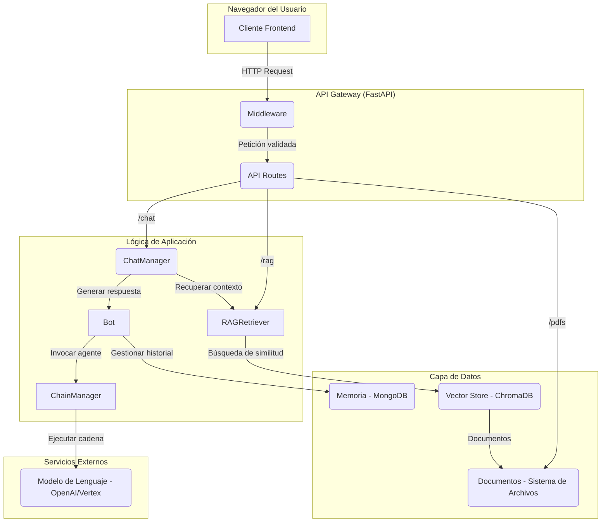

# Estructura y Arquitectura del Backend

Este documento detalla la estructura de directorios y la arquitectura del backend de la aplicación, construido con FastAPI.

## Diagrama de Flujo de Datos



## Estructura de Directorios Detallada

A continuación se describe la estructura de directorios del backend y el propósito de cada componente.

```
backend/
│
├── api/
│   ├── routes/
│   │   ├── bot/
│   │   │   └── bot_routes.py       # Endpoints para configurar el estado del bot.
│   │   ├── chat/
│   │   │   └── chat_routes.py      # Endpoints para streaming, historial y exportación del chat.
│   │   ├── health/
│   │   │   └── health_routes.py    # Endpoint de estado y salud de la aplicación.
│   │   ├── pdf/
│   │   │   └── pdf_routes.py       # Endpoints para la carga y gestión de archivos PDF.
│   │   └── rag/
│   │       └── rag_routes.py       # Endpoints para consultar estado y limpiar el RAG.
│   │
│   ├── schemas/                    # Modelos Pydantic para validación de datos en la API.
│   │   ├── base.py                 # Clases base para respuestas.
│   │   ├── chat.py                 # Esquemas para las peticiones y respuestas de chat.
│   │   └── ...                     # Otros esquemas (pdf, rag, health).
│   │
│   └── app.py                      # Creación y configuración central de la app FastAPI.
│
├── chat/
│   └── manager.py                  # ChatManager: Orquesta la interacción entre el Bot y el RAG.
│
├── core/                           # Núcleo de la lógica del chatbot.
│   ├── bot.py                      # Bot: Clase principal que encapsula el agente, memoria y cadena.
│   ├── chain.py                    # ChainManager: Gestiona la creación de la cadena LangChain, el LLM y los prompts.
│   └── prompt.py                   # Módulo con todas las plantillas de prompts y personalidades del bot.
│
├── rag/                            # Sistema de Retrieval-Augmented Generation (RAG).
│   ├── embeddings/
│   │   └── embedding_manager.py    # Gestiona la carga de los modelos de embeddings (p.ej. Sentence Transformers).
│   ├── ingestion/
│   │   └── ingestor.py             # RAGIngestor: Orquesta la ingesta de documentos (carga, división, embedding y almacenamiento).
│   ├── pdf_processor/
│   │   └── pdf_loader.py           # PDFContentLoader: Carga el contenido de los PDFs y los divide en chunks.
│   ├── retrieval/
│   │   └── retriever.py            # RAGRetriever: Realiza la búsqueda de similitud en el Vector Store para obtener contexto.
│   └── vector_store/
│       └── vector_store.py         # VectorStore: Abstracción sobre la base de datos vectorial (ChromaDB).
│
├── storage/                        # Almacenamiento persistente local.
│   ├── documents/
│   │   ├── pdf_manager.py          # PDFManager: Gestiona las operaciones de archivos PDF (guardar, listar, eliminar).
│   │   └── pdfs/                   # Directorio donde se guardan los PDFs subidos.
│   └── vector_store/
│       └── chroma_db/              # Base de datos vectorial de ChromaDB.
│
├── database/
│   └── mongodb.py                  # Cliente de MongoDB para conexión y operaciones básicas.
│
├── memory/                         # Gestión de la memoria de conversación.
│   ├── base_memory.py              # Implementación de memoria básica en RAM.
│   ├── custom_memory.py            # (Opcional) Clases de memoria personalizadas.
│   ├── memory_types.py             # Enum para los tipos de memoria disponibles.
│   └── mongo_memory.py             # CustomMongoChatbotMemory: Implementación de memoria persistente en MongoDB.
│
├── models/
│   └── model_types.py              # Enum para los tipos de modelos de lenguaje soportados (OpenAI, Vertex).
│
├── common/
│   ├── constants.py                # Constantes compartidas en la aplicación.
│   └── objects.py                  # Objetos de datos comunes (p.ej. Message).
│
├── dev/                            # Scripts para desarrollo y pruebas.
│
├── utils/
│   └── chain_cache.py              # Sistema de caché (potencialmente para cadenas o respuestas).
│
├── config.py                       # Configuración centralizada de la aplicación usando Pydantic's BaseSettings.
├── main.py                         # Punto de entrada principal para iniciar el servidor uvicorn.
├── requirements.txt                # Dependencias de Python.
├── setup.sh & setup.bat            # Scripts de inicialización y configuración.
└── Dockerfile                      # Definición del contenedor Docker para el backend.

```

## Descripción de Componentes Clave

- **`main.py`**: El punto de entrada que carga las variables de entorno, invoca a `create_app` y arranca el servidor `uvicorn`.

- **`api/app.py`**: El corazón de la aplicación FastAPI.

  - Utiliza un `lifespan` para inicializar y destruir recursos clave como `ChatManager`, `RAGIngestor`, y el `VectorStore` al iniciar y detener la aplicación.
  - Configura middlewares (CORS, logging de peticiones).
  - Registra todos los routers de la API.

- **`core/bot.py`**: La clase `Bot` actúa como el cerebro del chatbot.

  - Inicializa y mantiene una instancia de `ChainManager` y el sistema de `Memoria`.
  - Configura y expone un `AgentExecutor` de LangChain que combina el LLM, los prompts y las herramientas (si las hubiera).

- **`core/chain.py`**: La clase `ChainManager` se encarga de todo lo relacionado con el modelo de lenguaje.

  - Carga la configuración del modelo (p.ej. `gpt-3.5-turbo`, temperatura, `max_tokens`) desde `config.py`.
  - Instancia el cliente del LLM (`ChatOpenAI`, etc.).
  - Carga y formatea las plantillas de `prompt` desde `core/prompt.py`.
  - Construye y expone la `Runnable` de LangChain que será ejecutada.

- **`chat/manager.py`**: La clase `ChatManager` es el nexo entre la API y la lógica del bot.

  - Recibe las peticiones de chat desde las rutas.
  - Invoca al `RAGRetriever` para obtener contexto relevante de los documentos.
  - Pasa el input del usuario y el contexto recuperado al `Bot` para generar una respuesta.
  - Gestiona la interacción con la memoria para guardar el historial.

- **`rag/ingestor.py`**: `RAGIngestor` gestiona el proceso de añadir nuevos conocimientos al sistema.
  - Usa `PDFManager` para acceder al archivo.
  - Usa `PDFContentLoader` para extraer texto y dividirlo en fragmentos.
  - Usa `EmbeddingManager` para convertir los fragmentos en vectores.
  - Usa `VectorStore` para guardar los vectores en ChromaDB.

```

```
