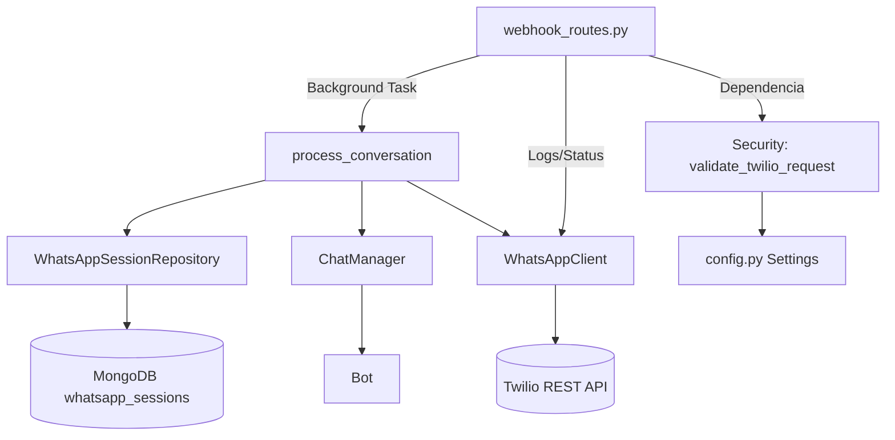
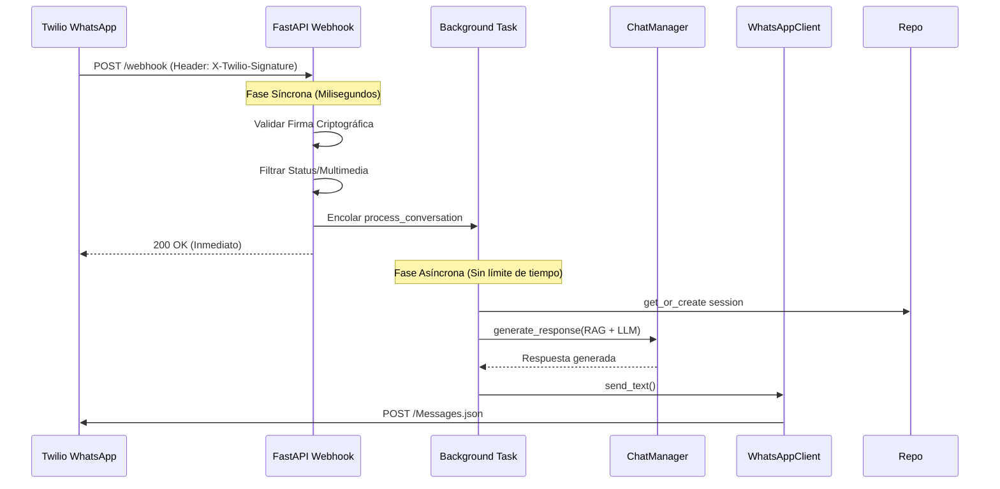

## Integración WhatsApp (Twilio)

### 1\. Estructura de archivos

  - `backend/api/routes/whatsapp/webhook_routes.py` — Controlador principal: valida firma, encola tareas en segundo plano y responde 200 OK inmediato.
  - `backend/utils/whatsapp/client.py` — Cliente HTTP optimizado hacia Twilio REST API.
  - `backend/utils/whatsapp/formatter.py` — Normalizador de texto.
  - `backend/database/whatsapp_session_repository.py` — Gestión de sesiones persistentes en MongoDB.
  - `backend/config.py` — Configuración tipada con Pydantic (acceso seguro a secretos).
  - `backend/auth/middleware.py` — Exclusión de rutas públicas.

Diagrama de dependencias:

### 2\. Flujo de trabajo (Arquitectura Asíncrona)

Para evitar timeouts de Twilio (límite de 15s) y reintentos duplicados, el sistema usa **BackgroundTasks**.

Diagrama de secuencia:

Paso a paso:

1.  **Entrada Segura:** Twilio envía el mensaje. Se valida el header `X-Twilio-Signature` usando el `TWILIO_AUTH_TOKEN` para asegurar que no es un ataque de spoofing.
2.  **Filtros Rápidos:** \* Si es actualización de estado (`sent`, `read`), se ignora (200 OK).
      * Si es multimedia (foto/audio), se responde con aviso de "solo texto" (200 OK).
3.  **Acknowledge:** El servidor responde `200 OK` en milisegundos. Twilio queda satisfecho y no reintenta.
4.  **Procesamiento (Background):** FastAPI ejecuta la lógica de negocio: busca sesión, consulta al LLM/RAG y genera respuesta.
5.  **Respuesta Asíncrona:** El servidor inicia una *nueva* petición HTTP hacia Twilio para enviar la respuesta final al usuario.

### 3\. Configuraciones requeridas

Variables de entorno (Cargadas vía Pydantic en `config.py`):

  - `TWILIO_ACCOUNT_SID`: Identificador de cuenta.
  - `TWILIO_AUTH_TOKEN`: **Crítico**. Se usa tanto para enviar mensajes como para validar la firma de los mensajes entrantes.
  - `TWILIO_WHATSAPP_FROM`: Número del bot (ej. `whatsapp:+1415...`).
  - `TWILIO_API_BASE`: URL base (default `https://api.twilio.com`).

### 4\. Dependencias Clave

  - **FastAPI BackgroundTasks**: Para desacoplar la recepción del procesamiento.
  - **Twilio SDK (`RequestValidator`)**: Para validación de seguridad.
  - **HTTPX**: Cliente asíncrono reutilizable para envíos.
  - **Pydantic**: Validación estricta de configuraciones (`SecretStr`).

### 5\. Manejo de errores y Casos Borde

| Caso | Comportamiento | Código HTTP |
| :--- | :--- | :--- |
| **Firma Inválida** | Intento de hackeo o mala configuración. | `403 Forbidden` |
| **Timeout IA** | La IA tarda \>15s. No afecta, el usuario espera. | `200 OK` (Webhook) |
| **Multimedia** | Usuario envía foto. Se envía aviso automático. | `200 OK` |
| **Error Interno** | Fallo en DB/OpenAI. Se envía mensaje de error al usuario. | `200 OK` (Webhook) |
| **Status Update** | Notificación de "Leído". Se ignora silenciosamente. | `200 OK` |

### 6\. Consideraciones de Seguridad

1.  **Validación de Origen:** Es imposible inyectar mensajes falsos sin conocer el `TWILIO_AUTH_TOKEN`. El middleware `validate_twilio_request` rechaza peticiones no firmadas.
2.  **Protección de Secretos:** El token se maneja como `SecretStr` en memoria y nunca se expone en logs (se usa enmascarado en diagnóstico).
3.  **Sanitización:** Se eliminan caracteres de control nulos antes de procesar el texto.

### Endpoints de Utilidad

Aunque el flujo principal es automático, existen rutas para diagnóstico (usar con precaución en producción):

  - `GET /test`: Verifica conexión con API Twilio.
  - `GET /diag`: Muestra estado de carga de variables (con secretos ofuscados).
  - `GET /send-test?to=...&text=...`: Fuerza un envío de mensaje saliente.