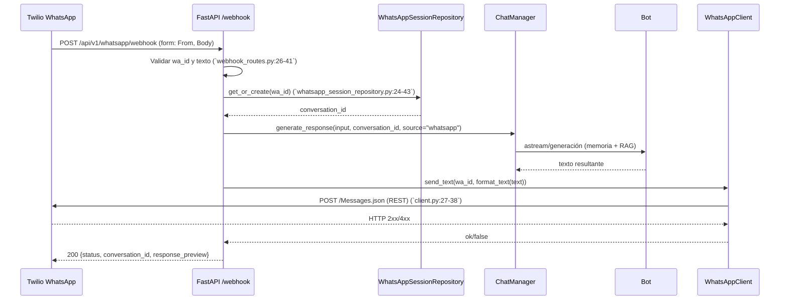

## Integración WhatsApp (Twilio)

### 1. Estructura de archivos

- `backend/api/routes/whatsapp/webhook_routes.py` — Controlador HTTP de WhatsApp: webhook público, diagnóstico y envíos de prueba
- `backend/utils/whatsapp/client.py` — Cliente HTTP hacia Twilio REST API para enviar mensajes WhatsApp
- `backend/utils/whatsapp/formatter.py` — Normalizador/limitador de texto antes del envío
- `backend/database/whatsapp_session_repository.py` — Persistencia de sesiones por `wa_id` y vínculo `conversation_id`
- `backend/config.py` — Variables de entorno Twilio/WhatsApp cargadas en `Settings`
- `backend/auth/middleware.py` — Lista de rutas públicas exactas; el webhook está permitido sin token
- `backend/api/app.py` — Registro del router `whatsapp` bajo `prefix="/api/v1/whatsapp"`

Diagrama de dependencias entre archivos:

```mermaid
graph TD
    A[webhook_routes.py] --> B[WhatsAppSessionRepository]
    A --> C[ChatManager]
    A --> D[formatter.py]
    A --> E[WhatsAppClient]
    B --> F[(MongoDB whatsapp_sessions)]
    C --> G[Bot]
    G --> H[RAGRetriever]
    H --> I[(Qdrant)]
    E --> J[(Twilio REST API)]
    E --> K[config.py Settings]
    A --> L[auth/middleware.py (PUBLIC_EXACT)]
```

Referencias clave:

- Registro de router: `backend/api/app.py:430`
- Webhook: `backend/api/routes/whatsapp/webhook_routes.py:14`
- Cliente Twilio: `backend/utils/whatsapp/client.py:8-18`
- Repositorio sesiones: `backend/database/whatsapp_session_repository.py:11-21`
- Variables Twilio en settings: `backend/config.py:141-144`
- Ruta pública exacta del webhook: `backend/auth/middleware.py:19-29`

### 2. Flujo de trabajo

Diagrama de secuencia completo:



Paso a paso de cada etapa:

- Entrada externa: Twilio envía `POST` `application/x-www-form-urlencoded` con `From` (ej. `whatsapp:+14155238886`) y `Body` (texto)
- Validación: se revisa formato de `wa_id` y contenido del texto (`webhook_routes.py:29-47`)
- Sesión: se resuelve/crea `conversation_id` por `wa_id` en Mongo (`whatsapp_session_repository.py:24-43`) y se marca actividad (`touch`)
- Generación: `ChatManager` solicita respuesta al `Bot`; éste compone prompt con memoria y, si procede, recupera contexto RAG
- Formateo: se normaliza el texto (quitar saltos redundantes, cortar a 4000 chars) (`formatter.py:4-9`)
- Envío: `WhatsAppClient` invoca Twilio REST con `From`, `To`, `Body` (`client.py:27-38`) y reporta éxito
- Salida: el controlador responde 200 con `conversation_id` y `response_preview` de los primeros 100 caracteres

Puntos de entrada/salida principales:

- Entrada externa: `POST /api/v1/whatsapp/webhook` — público (`auth/middleware.py:24-26`)
- Diagnóstico: `GET /api/v1/whatsapp/test`, `GET /api/v1/whatsapp/diag`, `GET /api/v1/whatsapp/send-test` (`webhook_routes.py:100-160`)
- Salida hacia proveedor: Twilio REST `POST /2010-04-01/Accounts/{SID}/Messages.json` (`client.py:27`)

### 3. Configuraciones requeridas

Variables de entorno:

- `TWILIO_ACCOUNT_SID` — SID de cuenta (formato `ACxxxxxxxx...`) (`config.py:141`)
- `TWILIO_AUTH_TOKEN` — Auth Token de la cuenta (`config.py:142`)
- `TWILIO_WHATSAPP_FROM` — Remitente habilitado en WhatsApp, ej. `whatsapp:+14155238886` (`config.py:143`)
- `TWILIO_API_BASE` — Base REST, por defecto `https://api.twilio.com` (`config.py:144`)

Credenciales y permisos:

- La cuenta Twilio debe tener WhatsApp habilitado (Sandbox o número verificado/Business)
- `TWILIO_ACCOUNT_SID` debe iniciar con `AC` (`webhook_routes.py:111-113` en test)
- El remitente debe usar el prefijo `whatsapp:+` y corresponder a su número habilitado
- Configure el webhook entrante de Twilio a `POST https://<su-host>/api/v1/whatsapp/webhook`

Conexión con la API de WhatsApp (vía Twilio REST):

- Endpoint de envío: `POST {TWILIO_API_BASE}/2010-04-01/Accounts/{SID}/Messages.json`
- Autenticación: Basic Auth `(SID, AUTH_TOKEN)` (`client.py:37`)
- Content-Type: `application/x-www-form-urlencoded` con claves `From`, `To`, `Body`

### 4. Dependencias

- Librerías externas: `httpx` (HTTP async), `fastapi`, `pydantic`, `motor/pymongo` (Mongo), `re` (validación), `uuid`/`datetime`
- Versiones requeridas: `httpx>=0.25.1`, `fastapi>=0.104.0`, `motor>=3.3.0` (ver `backend/requirements.txt`)
- Configuraciones adicionales: tiempo de espera HTTP 10s, manejo de errores JSON/texto (`client.py:35-58, 60-77`)

### 5. Manejo de errores

- Errores comunes:
  - `wa_id` inválido (no cumple `^whatsapp:+\d{6,15}$`) → 400 (`webhook_routes.py:29-36`)
  - Texto vacío o con caracteres de control → 400 (`webhook_routes.py:36-47`)
  - Credenciales Twilio incompletas → envío retorna `False` o diagnóstico `status: 400` (`client.py:18-25`, `client.py:61-63`)
  - HTTP 4xx/5xx de Twilio con código/mensaje → log de detalle (`client.py:41-49`)
- Soluciones recomendadas:
  - Verificar y cargar correctamente las variables `TWILIO_*`
  - Confirmar que el número `From` está habilitado para WhatsApp en Twilio
  - Revisar formato del `To` y `From` con prefijo `whatsapp:+`
  - Usar `GET /api/v1/whatsapp/test` y `GET /api/v1/whatsapp/diag` para diagnóstico rápido
- Logs importantes:
  - Prefijo `[WhatsApp]` en controlador (`webhook_routes.py:22, 50-55, 71-85`)
  - Errores de Twilio detallados (`client.py:41-49`)

### 6. Consideraciones de seguridad

- Manejo de datos sensibles:
  - No exponer `TWILIO_AUTH_TOKEN` en logs; el diagnóstico lo enmascara (`webhook_routes.py:134-141`)
  - Mantener `.env` fuera de control de versiones
- Buenas prácticas implementadas:
  - Validación estricta de `wa_id` y sanitización de texto
  - Webhook agregado a rutas públicas exactas para evitar falsos 401 (`auth/middleware.py:19-29`)
- Restricciones de acceso:
  - Actualmente, `test`, `diag` y `send-test` NO están bajo prefijos admin; considere protegerlos en producción
  - Recomendación: añadir `/api/v1/whatsapp` al conjunto `ADMIN` en `auth/middleware.py` o requerir API Key/IP whitelisting

### Ejemplos de uso

- Twilio Webhook de ejemplo (form-urlencoded):

```http
POST /api/v1/whatsapp/webhook
Content-Type: application/x-www-form-urlencoded

From=whatsapp:+14155238886&Body=Hola%20bot
```

- Envío de prueba desde API:

```bash
curl "http://localhost:8000/api/v1/whatsapp/send-test?to=whatsapp:+14155238886&text=Hola%20desde%20API"
```

- Diagnóstico de credenciales:

```bash
curl http://localhost:8000/api/v1/whatsapp/diag
curl http://localhost:8000/api/v1/whatsapp/test
```

---

Esta sección documenta íntegramente la integración de WhatsApp vía Twilio en el backend, permitiendo operar, auditar y mantener el flujo end-to-end de mensajería WhatsApp.