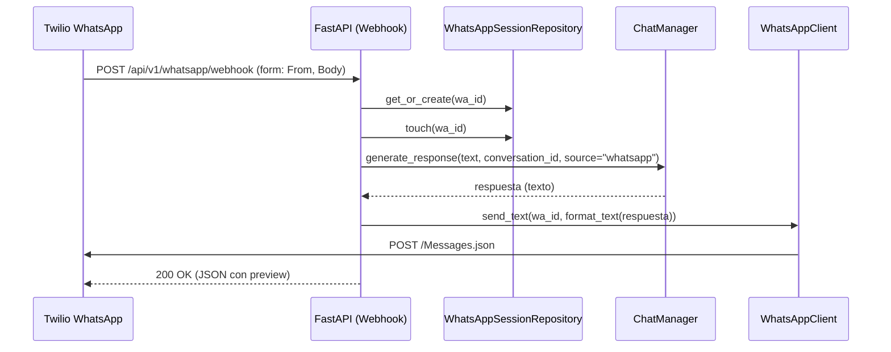

# Integración de WhatsApp (Twilio) — Referencia Técnica

## 1. Descripción General

- Propósito: habilitar entrada y salida de mensajes de WhatsApp mediante Twilio, vinculando cada `wa_id` con una conversación del bot y devolviendo respuestas generadas por el LLM/RAG.
- Tecnologías/frameworks: `FastAPI` (API), `httpx` (cliente HTTP asíncrono), `MongoDB` (sesiones y mensajes), `Pydantic`/`pydantic-settings` (configuración tipada), `LangChain`/componentes internos del bot.
- Dependencias principales:
  - Twilio REST API para WhatsApp (`Messages.json`).
  - `httpx` para llamadas salientes a Twilio.
  - `motor`/`pymongo` para persistencia.
  - Módulos internos: `ChatManager`, `Bot`, `WhatsAppClient`, `WhatsAppSessionRepository`.

## 2. Estructura de Archivos

Listado completo de archivos relacionados con WhatsApp:

- `backend/api/routes/whatsapp/webhook_routes.py` — Router de WhatsApp: entrada de webhook y utilidades de diagnóstico. Punto de entrada principal. Referencias: `webhook` en `backend/api/routes/whatsapp/webhook_routes.py:14`, `test` en `backend/api/routes/whatsapp/webhook_routes.py:100`, `diag` en `backend/api/routes/whatsapp/webhook_routes.py:127`, `send-test` en `backend/api/routes/whatsapp/webhook_routes.py:146`.
- `backend/utils/whatsapp/client.py` — Cliente HTTP hacia Twilio. Envío de texto y diagnóstico. Referencias: `WhatsAppClient` en `backend/utils/whatsapp/client.py:8`, `send_text` en `backend/utils/whatsapp/client.py:18`, `send_text_diagnostics` en `backend/utils/whatsapp/client.py:60`.
- `backend/utils/whatsapp/formatter.py` — Formateo/sanitización de texto de salida. Referencia: `format_text` en `backend/utils/whatsapp/formatter.py:4`.
- `backend/database/whatsapp_session_repository.py` — Sesiones por `wa_id` (conversación asociada) en MongoDB. Referencias: `WhatsAppSessionRepository` en `backend/database/whatsapp_session_repository.py:11`, `get_or_create` en `backend/database/whatsapp_session_repository.py:24`, `touch` en `backend/database/whatsapp_session_repository.py:45`.
- `backend/api/app.py` — Registro del router: `app.include_router(whatsapp_router, prefix="/api/v1/whatsapp")` en `backend/api/app.py:437`. Índices de colección `whatsapp_sessions` inicializados en `backend/api/app.py:258-261`.
- `backend/auth/middleware.py` — El webhook de WhatsApp es ruta pública exacta: `"/api/v1/whatsapp/webhook"` en `backend/auth/middleware.py:25`.
- `backend/config.py` — Variables de entorno y configuración Twilio: `twilio_account_sid`, `twilio_auth_token`, `twilio_whatsapp_from`, `twilio_api_base` en `backend/config.py:141-144`.
- `backend/database/config_repository.py` y `backend/api/schemas/config.py` — Exponen Twilio en la configuración del bot y permiten actualizar credenciales vía endpoints admin (`PUT /api/v1/bot/config`). Referencias: `BotConfig` campos Twilio en `backend/database/config_repository.py:20-22`, `update_config` Twilio en `backend/database/config_repository.py:64-85`, DTO en `backend/api/schemas/config.py:14-16`.
- `backend/chat/manager.py` — Generación de respuesta del bot y persistencia en mensajes. Referencias: `generate_response` en `backend/chat/manager.py:26-83`.

## 3. Flujo Principal

Diagrama de alto nivel (secuencia):

Secuencia de llamadas entre componentes:

- Entrada: `POST /api/v1/whatsapp/webhook` en `backend/api/routes/whatsapp/webhook_routes.py:14`.
- Sesión: `get_or_create` y `touch` en `backend/database/whatsapp_session_repository.py:24` y `backend/database/whatsapp_session_repository.py:45`.
- Generación: `ChatManager.generate_response` en `backend/chat/manager.py:26`.
- Formateo: `format_text` en `backend/utils/whatsapp/formatter.py:4`.
- Envío: `WhatsAppClient.send_text` en `backend/utils/whatsapp/client.py:18`.

Puntos de entrada principales:

- Webhook entrante: `POST /api/v1/whatsapp/webhook`.
- Utilidades de diagnóstico y prueba: `GET /api/v1/whatsapp/test`, `GET /api/v1/whatsapp/diag`, `GET /api/v1/whatsapp/send-test`.

## 4. Endpoints

- `POST /api/v1/whatsapp/webhook`
  - Descripción: recibe mensajes entrantes de Twilio (WhatsApp) vía formulario.
  - Parámetros (form-data):
    - `From` (`string`, requerido): `whatsapp:+NNNN…` del remitente.
    - `Body` (`string`, requerido): texto del mensaje.
  - Respuestas:
    - `200 OK` `{ "status": "ok", "conversation_id": "<uuid>", "response_preview": "<primeros 100 chars>" }`.
    - `400 Bad Request` cuando `wa_id` o `text` son inválidos (validaciones en `backend/api/routes/whatsapp/webhook_routes.py:29-47`).
  - Notas: valida formato de `wa_id` y sanitiza caracteres de control; no realiza validación de firma Twilio aún.

- `GET /api/v1/whatsapp/test`
  - Descripción: prueba conectividad con Twilio Accounts API usando `sid` y `token`.
  - Respuestas: `{ "status": "ok" }` si `200`, o `{ "status": "error", "message": "HTTP <code>", "twilio": <detalle> }`.

- `GET /api/v1/whatsapp/diag`
  - Descripción: muestra estado de carga de credenciales (enmascaradas) y número `from`.
  - Respuesta: `{ loaded, sid(masked), token(masked), from, api_base }`.

- `GET /api/v1/whatsapp/send-test?to=whatsapp:+NNNN&text=...`
  - Descripción: envía un mensaje de prueba a un destino arbitrario.
  - Parámetros (query): `to` (formato `whatsapp:+...`), `text`.
  - Respuesta: `{ "status": "ok", "twilio": { ok, status, body } }` o `{ "status": "error", "twilio": { ... } }`.

## 5. Mecanismos Clave

- Procesos asíncronos: todas las operaciones (Mongo, HTTP a Twilio, LLM) se ejecutan de forma asíncrona (`async/await`). El envío a Twilio se realiza dentro del mismo ciclo del webhook; no se usa `BackgroundTasks`.
- Manejo de errores:
  - Validación de `wa_id` y `text` con mensajes claros (`400`) en `backend/api/routes/whatsapp/webhook_routes.py:29-47`.
  - Registro exhaustivo de fallos en llamada a Twilio con detalles (`status`, `message`, `more_info`) en `backend/utils/whatsapp/client.py:41-49`.
  - Tiempos de espera del LLM controlados en `ChatManager.generate_response` (`timeout` configurable) en `backend/chat/manager.py:50-59`.
- Reconexiones automáticas: actualmente no se implementan reintentos/backoff en `WhatsAppClient`. Sugerido en Próximos Pasos.
- Gestión de sesiones: colección `whatsapp_sessions` con índices (`wa_id` único y `updated_at`) en `backend/database/whatsapp_session_repository.py:16-23`; mapeo de `wa_id` → `conversation_id`.

## 6. Análisis de Código

- Pendiente de Revisión:
  - Validación criptográfica de la firma `X-Twilio-Signature` en el webhook (no presente). Recomendado usar el validador oficial y el `TWILIO_AUTH_TOKEN`.
  - Límite de tiempo del webhook respecto al SLA de Twilio: el flujo actual genera respuesta antes de responder; podría exceder ventanas bajo carga.
- Código redundante identificado:
  - Manejo de logs con `try/except` anidados en `webhook_routes.py` y `client.py` que puede simplificarse manteniendo robustez.
- Funcionalidades no utilizadas:
  - No hay soporte para mensajes multimedia entrantes; el router asume `Body` texto.
- Posibles mejoras/refactors:
  - Incorporar `BackgroundTasks` o encolado (cola de trabajo) para desacoplar recepción y envío.
  - Añadir reintentos con backoff exponencial en `WhatsAppClient.send_text`.
  - Implementar validación de firma Twilio en el webhook y registrar `AccountSid` del request.
  - Estandarizar respuestas de error y códigos para diagnósticos operativos.
  - Limitar tamaño de mensajes entrantes; ya se limita salida a 4000 chars (`formatter.py`), extender a entrada.

## 7. Próximos Pasos

- Acciones prioritarias:
  - Implementar validación `X-Twilio-Signature` en `POST /webhook`.
  - Desacoplar el procesamiento usando `BackgroundTasks` o una cola (evitar timeouts).
  - Añadir política de reintentos con `httpx.Retry`/manual y telemetría de fallos.
- Mejoras sugeridas:
  - Soporte para mensajes multimedia (ignorados o convertidos a texto con OCR cuando corresponda).
  - Rate limiting por `wa_id` para evitar abuso.
  - Observabilidad: métricas por endpoint y latencia de Twilio/LLM.
- Tareas de limpieza recomendadas:
  - Simplificar bloques de logging anidados.
  - Consolidar validaciones en helpers reutilizables.

---

### Variables de Entorno (referencia)

Config en `backend/config.py:141-144` y ejemplo en `.env` (no exponer valores reales):

- `TWILIO_ACCOUNT_SID` — SID de cuenta Twilio (prefijo `AC`).
- `TWILIO_AUTH_TOKEN` — Token secreto de autenticación.
- `TWILIO_WHATSAPP_FROM` — Remitente, formato `whatsapp:+NNNN…`.
- `TWILIO_API_BASE` — Base de API, por defecto `https://api.twilio.com`.

> Seguridad: no incluir ni publicar valores reales del `.env`. Use almacenamiento seguro y rotación periódica.